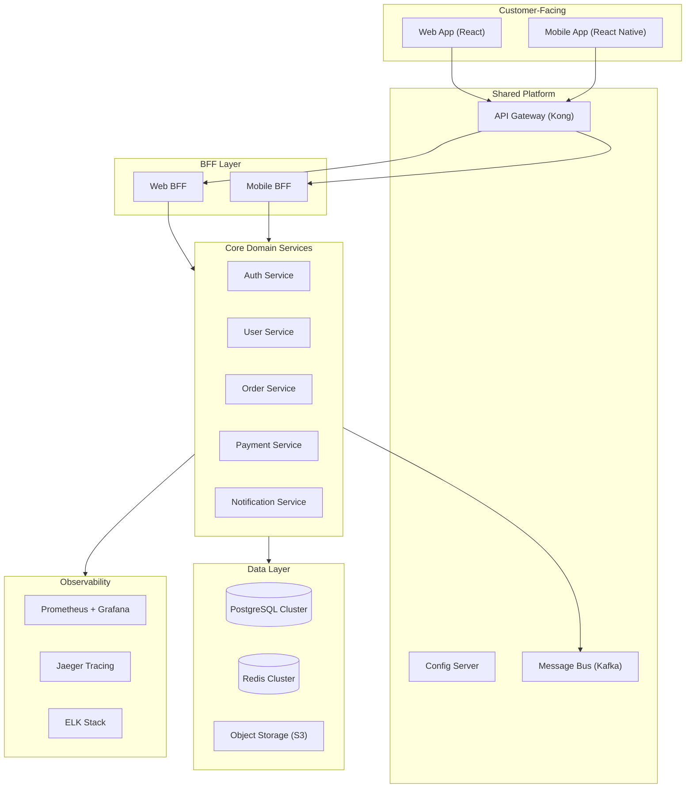

# Company Knowledge Base

> **Company:** [YOUR COMPANY NAME]
> **Last Updated:** [DATE]
> **Maintained by:** [ARCHITECT / TECH LEAD NAME]

## 1. System Landscape

## 2. Service Catalog

| Service | Tech Stack | Team | Status | API Doc |
|---|---|---|---|---|
| Auth Service | Java 17 / Spring Boot 3 | Platform | Production | [swagger link] |
| User Service | Java 17 / Spring Boot 3 | Core Team | Production | [swagger link] |
| Order Service | Java 17 / Spring Boot 3 | Commerce Team | Production | [swagger link] |
| Payment Service | Java 17 / Spring Boot 3 | Payment Team | Production | [swagger link] |
| Notification Service | Node.js 20 | Platform | Production | [swagger link] |
| API Gateway | Kong 3.x | Platform | Production | — |
| Config Server | Spring Cloud Config | Platform | Production | — |

## 3. Technology Radar

### Approved (ADOPT)
| Category | Technology | Version | Notes |
|---|---|---|---|
| Language | Java | 17+ | Primary backend |
| Framework | Spring Boot | 3.x | All new services |
| Database | PostgreSQL | 16+ | Primary RDBMS |
| Cache | Redis | 7.x | Session, rate-limit, cache |
| Messaging | Apache Kafka | 3.x | Event-driven communication |
| Container | Kubernetes | 1.28+ | Shared cluster |
| CI/CD | GitHub Actions | — | Standard pipeline |
| Monitoring | Prometheus + Grafana | — | Metrics + dashboards |
| Tracing | Jaeger | — | Distributed tracing |
| Logging | ELK Stack | — | Centralized logging |

### On Trial
| Category | Technology | Notes |
|---|---|---|
| Language | Kotlin | Piloting in new microservices |
| Framework | Quarkus | Performance evaluation |
| Database | MongoDB | Document store evaluation |

### Hold (DO NOT USE)
| Category | Technology | Reason |
|---|---|---|
| Language | Java 8/11 | End-of-support |
| Framework | Spring Boot 2.x | Migration required |
| Database | MySQL | Consolidating to PostgreSQL |
| Messaging | RabbitMQ | Migrating to Kafka |

## 4. Team Topology

| Team | Type | Owns | Members | Contact |
|---|---|---|---|---|
| Platform Team | Platform | Auth, Gateway, Config, Notification, Infra | 6 | [slack channel] |
| Core Team | Stream-aligned | User, Profile, Settings | 4 | [slack channel] |
| Commerce Team | Stream-aligned | Order, Cart, Catalog | 5 | [slack channel] |
| Payment Team | Stream-aligned | Payment, Wallet, Top-up | 4 | [slack channel] |
| Mobile Team | Stream-aligned | Mobile App, Mobile BFF | 3 | [slack channel] |
| Web Team | Stream-aligned | Web App, Web BFF | 3 | [slack channel] |
| Data Team | Enabling | Data Pipeline, Analytics | 3 | [slack channel] |

### Interaction Modes
| From | To | Mode |
|---|---|---|
| Stream teams | Platform | X-as-a-Service |
| Stream teams | Stream teams | Collaboration (when needed) |
| Data Team | All | Facilitating |

## 5. Shared Infrastructure

### API Gateway (Kong)
- **URL:** `https://api.yourcompany.com`
- **Auth:** JWT validation via Auth Service
- **Rate limiting:** Global 1000 req/s, per-user 100 req/s
- **Plugins:** jwt, rate-limiting, cors, request-transformer

### Messaging (Kafka)
- **Cluster:** 3 brokers, shared
- **Topic naming:** `{domain}.{entity}.{event}` (e.g., `payment.transaction.completed`)
- **Retention:** 7 days default, 30 days for audit topics
- **Schema registry:** Confluent Schema Registry (Avro)

### Database (PostgreSQL)
- **Cluster:** Primary + 2 read replicas
- **Schema policy:** Each service owns its schema, NO cross-service queries
- **Connection pooling:** PgBouncer
- **Backup:** Daily full + WAL archiving, RPO < 5 min

### Cache (Redis)
- **Cluster:** 3-node cluster, shared
- **Key naming:** `{service}:{entity}:{id}` (e.g., `auth:session:uuid`)
- **Max TTL:** 24h for sessions, 5min for data cache

## 6. Compliance & Security

### Data Classification
| Level | Examples | Encryption | Access |
|---|---|---|---|
| Public | Product info, FAQ | None | Open |
| Internal | Employee data, configs | At-rest | Role-based |
| Confidential | User PII, financial | At-rest + In-transit | Need-to-know |
| Restricted | Payment card data | PCI-DSS full | PCI-DSS zone only |

### Compliance Requirements
| Standard | Scope | Status |
|---|---|---|
| PCI-DSS | Payment data | Certified |
| GDPR / PDPA | User PII | Compliant |
| SOC 2 Type II | All services | In progress |

### Security Standards
- Authentication: OAuth 2.0 + OIDC (Keycloak)
- Authorization: RBAC with service-level policies
- Encryption: TLS 1.3 in-transit, AES-256 at-rest
- Secrets: HashiCorp Vault
- Scanning: SonarQube (SAST), Trivy (container)

## 7. Architecture Constraints

| # | Constraint | Rationale |
|:---:|---|---|
| C1 | All new services MUST use Java 17+ / Spring Boot 3 | Standardization |
| C2 | Each service MUST own its database schema | Data isolation |
| C3 | Cross-service communication MUST use Kafka for async, REST/gRPC for sync | Decoupling |
| C4 | All APIs MUST go through API Gateway | Security, rate-limiting |
| C5 | PII data MUST be encrypted at-rest and in-transit | Compliance |
| C6 | All services MUST publish health, readiness, liveness endpoints | K8s operations |
| C7 | All services MUST integrate with Prometheus metrics | Observability |
| C8 | API versioning MUST use URL path (/v1/, /v2/) | Consistency |

## 8. Architecture Decision Records (Company-level)

| ADR | Decision | Date | Status |
|---|---|---|---|
| ADR-001 | Use Kafka over RabbitMQ for event-driven | 2024-01 | Accepted |
| ADR-002 | PostgreSQL as primary RDBMS | 2024-01 | Accepted |
| ADR-003 | Kong as API Gateway | 2024-03 | Accepted |
| ADR-004 | Keycloak for IAM | 2024-03 | Accepted |
| ADR-005 | Each service owns its schema | 2024-06 | Accepted |
| ADR-006 | URL-based API versioning | 2024-06 | Accepted |
