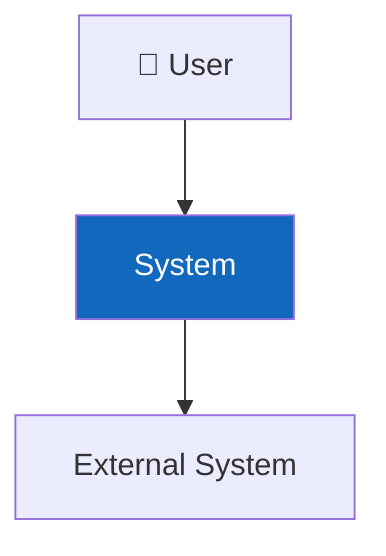
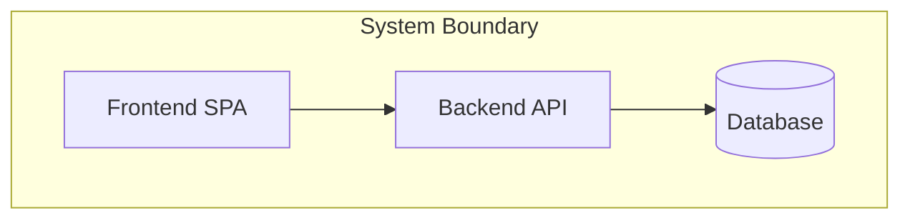
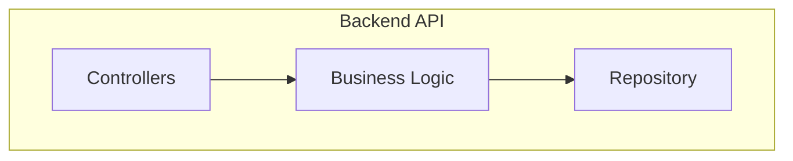
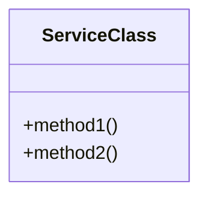

# C4 Model Quick Reference

Hướng dẫn sử dụng C4 Model trong thiết kế kiến trúc.

## 4 Levels

| Level | Name | Shows | Audience |
|:---:|---|---|---|
| 1 | System Context | Hệ thống + actors + external systems | Everyone |
| 2 | Container | Deployable units (apps, DBs, queues) | Tech team |
| 3 | Component | Internal modules within 1 container | Dev team |
| 4 | Code | Classes, interfaces, relationships | Developers |

## Mermaid Templates

### Level 1 — System Context

### Level 2 — Container

### Level 3 — Component

### Level 4 — Code (Class Diagram)

## Rules
1. Each level zooms into ONE element from the level above
2. Include description tables alongside diagrams
3. Use consistent color coding (blue=new, gray=existing)
4. Mermaid syntax: quote labels with special characters
5. Max ~10-15 elements per diagram for readability
