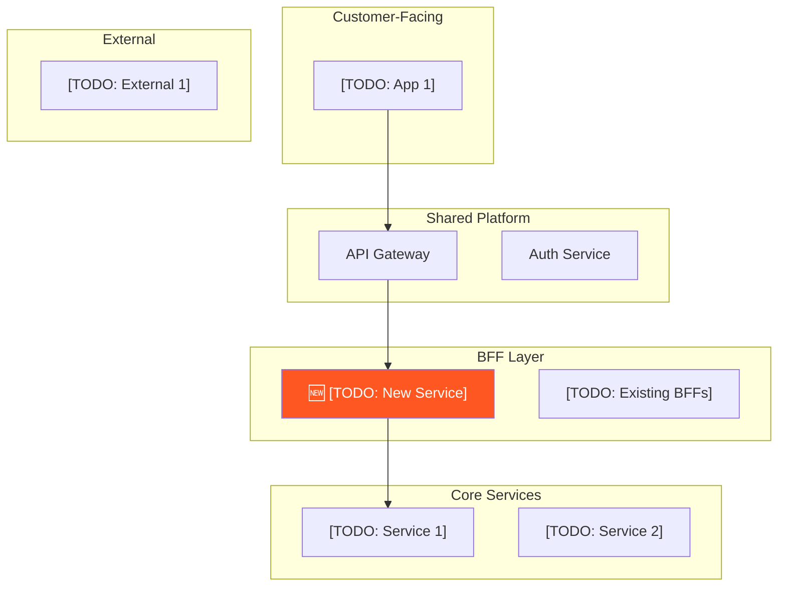

# Enterprise Context

> **Project:** [TODO: Project name]
> **Date:** [TODO: Date]

## 1. System Landscape

### Service Catalog

| Service | Owner Team | Tech Stack | Relationship to New Service |
|---|---|---|---|
| [TODO] | [TODO] | [TODO] | Downstream / Upstream / None |

## 2. Dependency Matrix

### Upstream (services calling INTO new service)
| Service | API | Data Flow | SLA |
|---|---|---|---|
| [TODO] | [TODO] | [TODO] | [TODO] |

### Downstream (services new service CALLS OUT to)
| Service | API | Data Flow | SLA |
|---|---|---|---|
| [TODO] | [TODO] | [TODO] | [TODO] |

## 3. Business Domain

| Aspect | Value |
|---|---|
| Bounded Context | [TODO] |
| Business Capability | [TODO] |
| Data Ownership | [TODO: Which entities does new service own?] |

## 4. Technology Constraints

### Approved Stack
| Layer | Approved Technologies |
|---|---|
| Language | [TODO] |
| Framework | [TODO] |
| Database | [TODO] |
| Cloud | [TODO] |

### Governance Rules
- [TODO: Rule 1]

## 5. Team Topology

| Role | Team | Contact |
|---|---|---|
| Owning Team | [TODO] | [TODO] |
| Collaborating Teams | [TODO] | [TODO] |

## 6. Compliance Requirements

| Requirement | Details |
|---|---|
| Data Classification | [TODO: PII / Confidential / Public] |
| Encryption | [TODO: At-rest / In-transit] |
| Retention | [TODO: X months/years] |
| Regulatory | [TODO: PCI-DSS / HIPAA / Insurance regs] |
