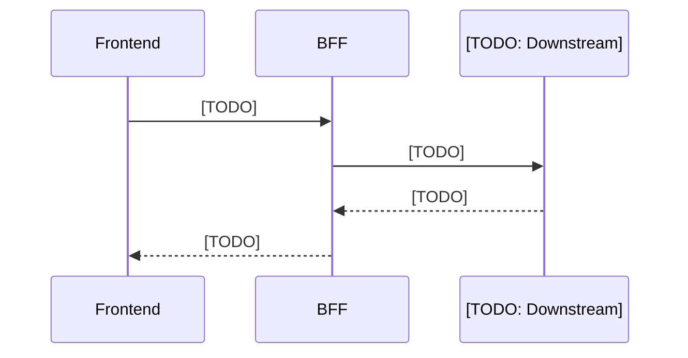

# API Design

> **Project:** [TODO]
> **Date:** [TODO]
> **Base URL:** [TODO: /api/v1/...]

## 1. Endpoint Catalog

| # | Method | Path | Step | Description |
|:---:|---|---|:---:|---|
| 1 | POST | [TODO] | [TODO] | [TODO] |
| 2 | GET | [TODO] | [TODO] | [TODO] |

## 2. Endpoint Details

### [TODO: Endpoint Name]

- **Method:** `[TODO]`
- **Path:** `[TODO]`
- **Step:** [TODO]

**Request:**
```json
{
  "[TODO]": "[TODO: type]"
}
```

**Response (200):**
```json
{
  "[TODO]": "[TODO: type]"
}
```

**Sequence:**


**Error Codes:**
| HTTP Status | Error Code | Description |
|:---:|---|---|
| 400 | [TODO] | [TODO] |
| 404 | [TODO] | [TODO] |
| 500 | [TODO] | [TODO] |

## 3. Error Handling Strategy

| Category | HTTP Status | Retry? | Description |
|---|:---:|:---:|---|
| Validation | 400 | No | [TODO] |
| Not Found | 404 | No | [TODO] |
| Downstream Error | 502 | Yes (3x) | [TODO] |
| Timeout | 504 | Yes (1x) | [TODO] |

## 4. Downstream API Mapping

| BFF Endpoint | Downstream Service | Downstream API | Data Transformation |
|---|---|---|---|
| [TODO] | [TODO] | [TODO] | [TODO] |
