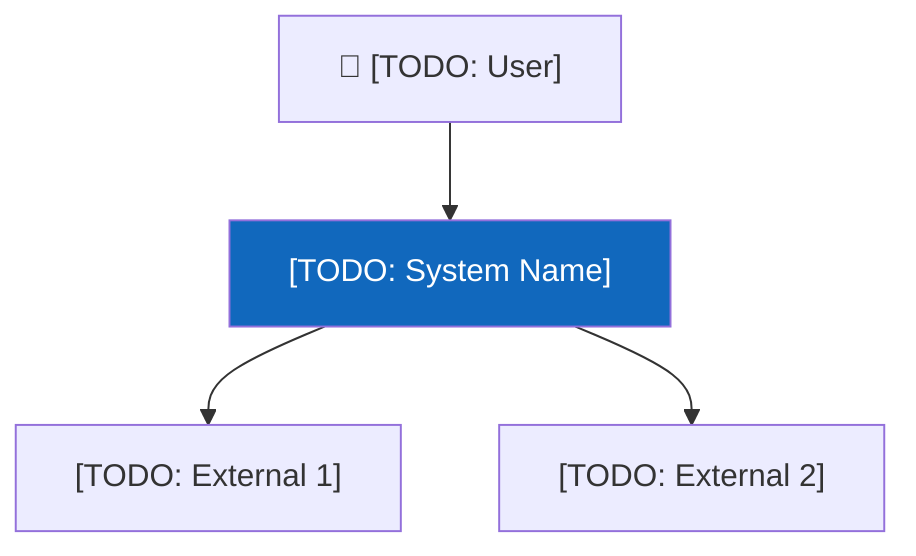
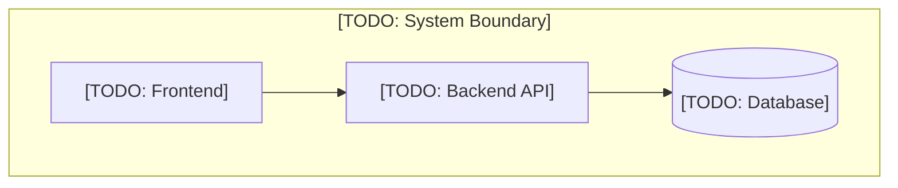
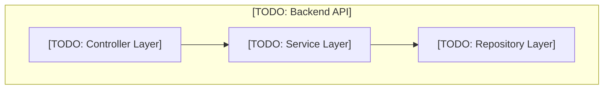
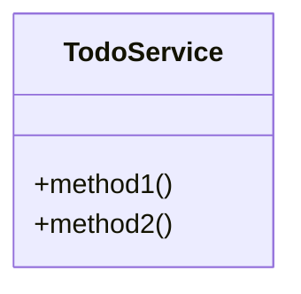

# C4 Architecture Models

> **Project:** [TODO]
> **Date:** [TODO]

## Level 1: System Context

| Element | Type | Description |
|---|---|---|
| [TODO] | Person / External System | [TODO] |

## Level 2: Container Diagram

| Container | Technology | Description |
|---|---|---|
| [TODO] | [TODO] | [TODO] |

## Level 3: Component Diagram

| Component | Responsibility | Technology |
|---|---|---|
| [TODO] | [TODO] | [TODO] |

## Level 4: Class Diagram

