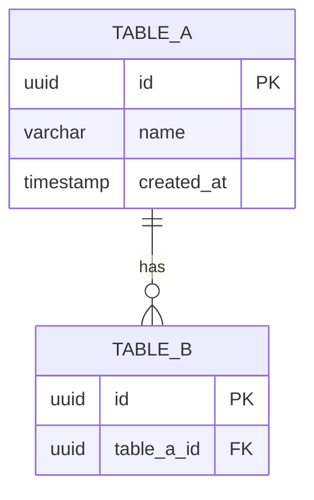

# Database Design

> **Project:** [TODO]
> **Date:** [TODO]
> **Engine:** [TODO: PostgreSQL 16+]

## 1. Technology Choice

| Decision | Choice | Rationale |
|---|---|---|
| Database engine | [TODO] | [TODO] |
| UUID strategy | [TODO: UUIDv7] | [TODO] |
| ORM | [TODO] | [TODO] |
| Connection pooling | [TODO: pgBouncer] | [TODO] |

## 2. ERD Diagram



## 3. DDL Scripts

### Enums
```sql
-- [TODO: Create enum types]
CREATE TYPE status_enum AS ENUM ('DRAFT', 'ACTIVE', 'COMPLETED');
```

### Tables
```sql
-- [TODO: Create tables]
CREATE TABLE [TODO] (
    id UUID PRIMARY KEY DEFAULT gen_random_uuid(),
    created_at TIMESTAMPTZ DEFAULT NOW(),
    updated_at TIMESTAMPTZ DEFAULT NOW()
);
```

### Indexes
```sql
-- [TODO: Create indexes]
CREATE INDEX idx_[TODO] ON [TODO]([TODO]);
```

## 4. Data Mapping (BFF DB → Downstream API)

| BFF Column | Downstream API Field | Mapping Logic |
|---|---|---|
| [TODO] | [TODO] | Direct / Transform: [TODO] |

## 5. Caching Strategy

| Data | Cache Type | TTL | Invalidation |
|---|---|---|---|
| [TODO] | [TODO: Redis / In-memory] | [TODO: 5 min] | [TODO] |

## 6. Storage Estimate

| Table | Rows (1 year) | Row Size | Total |
|---|---|---|---|
| [TODO] | [TODO] | [TODO: ~500 bytes] | [TODO: ~50 MB] |
