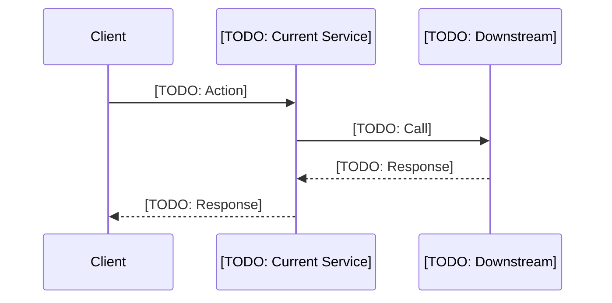
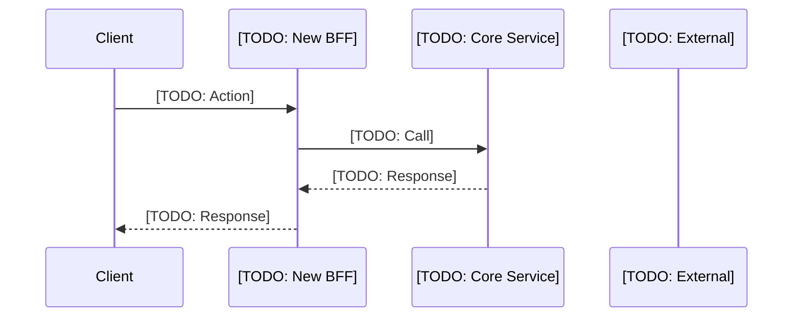

# Integration Architecture

> **Project:** [TODO]
> **Date:** [TODO]
> **Architecture Pattern:** [TODO: BFF / API Gateway / CQRS]

## 1. AS-IS Flow (Current State)

### Pain Points
- [TODO: Pain point 1]
- [TODO: Pain point 2]

## 2. TO-BE Flow (Target State)

### Improvements vs AS-IS
| # | Improvement | Rationale |
|:---:|---|---|
| 1 | [TODO] | [TODO] |

## 3. Architecture Pattern Decision

| Criteria | Chosen | Alternatives | Rationale |
|---|---|---|---|
| Pattern | [TODO] | [TODO] | [TODO] |
| Communication | [TODO: Sync REST / Async Event] | [TODO] | [TODO] |
| Data ownership | [TODO] | [TODO] | [TODO] |

## 4. Service Interaction Matrix

| From | To | API Path | Method | Data Exchanged | SLA |
|---|---|---|---|---|---|
| [TODO: BFF] | [TODO: Service] | [TODO: /api/v1/...] | POST | [TODO] | [TODO: 500ms] |

## 5. Technology Validation

| Layer | Chosen | Approved? | Notes |
|---|---|:---:|---|
| Language | [TODO] | ✅/❌ | [TODO] |
| Framework | [TODO] | ✅/❌ | [TODO] |
| Database | [TODO] | ✅/❌ | [TODO] |
| Messaging | [TODO] | ✅/❌ | [TODO] |
