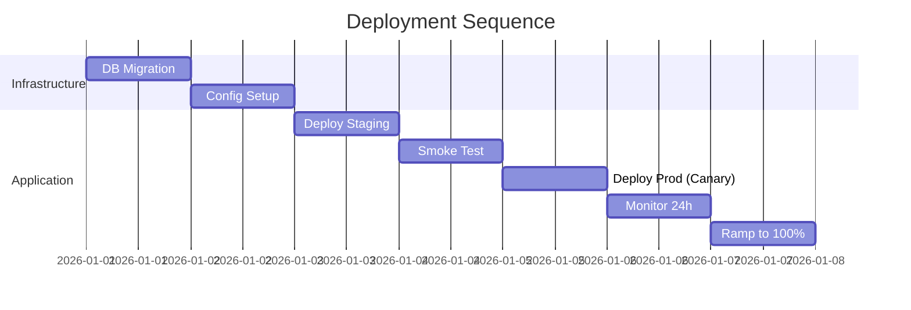

# Migration & Rollout Plan

> **Project:** [TODO]
> **Date:** [TODO]

## 1. Deployment Strategy

| Decision | Value | Rationale |
|---|---|---|
| Pattern | [TODO: Canary / Blue-Green / Rolling] | [TODO] |
| Feature Flags | [TODO: Yes/No — list flags] | [TODO] |
| Rollback Trigger | [TODO: Error rate > X%] | [TODO] |
| Rollback Time | [TODO: < X minutes] | [TODO] |

## 2. Deployment Sequence



## 3. Database Migration

| Order | Script | Type | Reversible? | Risk |
|:---:|---|---|:---:|:---:|
| 1 | [TODO: V001__name.sql] | DDL | ✅/⚠️ | Low/Med/High |

### Rollback Plan
```
IF migration fails:
  1. STOP application deployment
  2. Run rollback scripts in REVERSE order
  3. Verify data integrity
  4. Notify team
```

## 4. Integration Coordination

| Dependency | Team | What Needed | Deadline | Status |
|---|---|---|---|:---:|
| [TODO] | [TODO] | [TODO] | [TODO] | ☐ |

## 5. Pre-Go-Live Checklist

### Technical
- [ ] DB migration tested on staging
- [ ] Smoke test pass
- [ ] Performance test pass
- [ ] Security scan pass
- [ ] Monitoring configured
- [ ] Runbook documented
- [ ] On-call assigned
- [ ] Rollback tested

### Business
- [ ] UAT sign-off
- [ ] Marketing ready
- [ ] Support briefed
- [ ] Compliance approved
- [ ] Data retention configured

## 6. Risk Assessment

| Risk | Probability | Impact | Mitigation |
|---|:---:|:---:|---|
| [TODO] | Low/Med/High | Low/Med/High | [TODO] |

## 7. Rollout Phases

| Phase | Scope | Duration | Success Criteria | Go/No-go |
|---|---|---|---|---|
| [TODO] | [TODO] | [TODO] | [TODO] | [TODO] |
